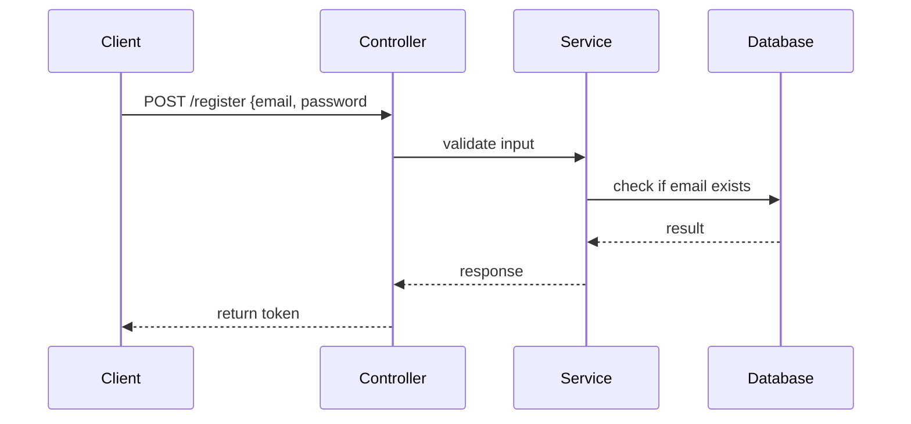

# 让 Claude 读懂大型项目：代码理解最佳实践

接手一个陌生项目，或者维护遗留代码，最头疼的就是理解整体架构。有了 Claude 帮忙，确实能快很多，但你得知道怎么正确引导它。这篇分享一些实战经验。

## Claude 的上下文限制：能做什么，不能做什么

首先要认清现实：

| Claude 版本 | 上下文窗口 | 大概能装多少代码 |
|-------------|-----------|----------------|
| Claude 3.5 Sonnet | 200K | ~500-1000个文件不等 |
| Claude 3 Opus | 200K | 同上 |

**所以：**
- ✅ **能搞定**：一个模块、一个功能、几十上百个文件
- ⚠️ **勉强搞定**：整个项目全部代码塞进去
- ❌ **搞不定**：几千个文件的超大项目一次性全装

认清这个度，期望管理很重要。

## 正确姿势：不是一次性全塞，而是逐步导航

正确的做法不是「逐步引导 Claude 逛你的项目，而不是一上来就全部塞进去。我一般是这么个流程：

---

### 第一步：先看整体结构

上来先让 Claude 了解项目整体结构：

```
帮我看看这个项目的目录结构，帮我分析一下：
1. 这是什么项目，用什么技术栈
2. 大概的架构是怎么分层的
3. 入口文件在哪里
```

Claude 会根据目录结构给你一个整体印象，你大概就知道从哪入手了。

---

### 第二步：找到入口

知道大概了，再找入口：

```
根据你刚才的分析，入口文件是哪个？帮我读一下入口文件，帮我梳理一下启动流程。
```

---

### 第三步：顺着依赖关系逐步深入

理解了启动流程，再顺着一条线往下走：

```
这个请求过来之后，会经过哪些中间件？路由到哪里？帮我继续分析这个控制器代码。
```

这样一步一步走，比你一下子把所有文件都塞进去清楚多了。

---

### 第四步：回答完一个模块，再看下一个

一个模块理解完了，再看下一个模块：

```
好，认证模块我们理解清楚了。接下来看看用户模块，帮我分析一下用户模块的代码结构。
```

## 引导 Claude 找代码的几个技巧

### 技巧 1：用 Search 先定位，再让 Claude 读

不要让 Claude 瞎猜，先用 search 找到相关代码：

```
search 帮我找一下项目中哪里处理了用户登录相关代码。
```

拿到搜索结果，再让 Claude 分析：

```
根据搜索结果，主要登录逻辑在 src/controllers/auth.js，帮我分析一下这个文件的逻辑。
```

这样比直接让 Claude 猜强太多了，因为 Trae 的 search 能直接找到代码，不用 Claude 瞎蒙。

### 技巧 2：先问「有哪些相关文件」

当你想改一个功能，不知道在哪，可以这么问：

```
我想修改「用户注册完成后发送欢迎邮件这个功能，项目中哪些文件和这个功能相关？帮我列出来。
```

Claude 会根据对项目的理解，给你列一个文件清单，然后你再逐个分析。

### 技巧 3：画调用关系图

理解代码结构清楚后，可以让 Claude 帮你画调用关系：

```
帮我整理一下用户注册流程的调用关系，用 Mermaid 流程图表示。
```



有了图，比读代码快很多。

### 技巧 4：从入口到出口走一遍

理解一个请求处理流程，这么问：

```
从用户点击登录按钮，到返回结果，整个流程依次经过哪些函数？帮我按顺序走一遍。
```

走一遍，整个流程就通了。

## 让 Claude 帮你做代码审查

代码理解清楚了，顺手让 Claude 帮你做代码审查，这招很好用。

### 怎么问效果好：

```
我要做一个需求：[说清楚你要改什么]
这是现有代码：[贴代码]
帮我 review 一下，看看：
1. 现有代码逻辑对不对
2. 如果我要加新功能，应该在哪改比较好
3. 改的时候要注意什么坑？
```

### 大规模重构，提前问一下：

```
我要把这个回调写法改成 async/await 写法，你看这个重构会不会有什么问题吗？需要注意什么？
```

## 遗留代码改造：AI 辅助重构经验

我最近用 Claude 改老代码重构，这几招挺管用。分享一下流程：

### Step 1：理解原有代码

```
这段代码是几年前写的，功能是 [说一下功能]。帮我读一下：
1. 整体思路是什么
2. 有哪些核心函数
3. 有什么地方写得比较绕，可能踩坑？
```

### Step 2：评估该不该重构

```
你看完了，你觉得这段代码有重构必要吗？主要问题在哪？如果重构，收益大不大？
```

有时候 Claude 会告诉你：这段虽然老，但其实能跑，不用重构。别瞎动。

### Step 3：设计重构方案

```
如果要重构，你有什么方案？分几步？每个方案优缺点是什么？推荐哪个？
```

### Step 4：小步重构，逐个验证

不要一下全改完再测试，改一点验证一点。每改完一块就让 Claude 看看对不对：

```
我按照方案改完这一块了，帮我看看改得对不对，有没有哪里漏了？
```

## 几个常见坑怎么破

### 坑 1：Claude 幻觉，说这个文件不存在

有时候 Claude 会说「这个文件我找不到啊」，怎么办？

**解法：你直接把文件路径告诉它：`这个文件就在这里，路径是 xxx.js，内容在这里：[贴内容]，帮我分析。**

### 坑 2：Claude 记错了函数名

AI 有时候会认错函数名，比如把 `getUser` 说成 `findUser`。

**解法**：这很正常，你直接告诉它：`项目里这个函数叫 getUser，不是 findUser，看这里代码：[指代码]，重新分析。**

### 坑 3：上下文满了，输出开始乱了

**解法：** 开到新对话，重新梳理一下现在的进度，继续：

```
我们之前分析到哪里了，现在到 [说一下当前进度，接下来要分析哪里，继续。**

开新对话比硬撑着好，上下文干净输出质量高。

### 坑 4：Claude 理解错了整体架构

有时候第一次分析错了架构，越走越歪。

**解法：** 发现不对，及时打断，重新来：

```
不对，我觉得我们理解错了，这个项目其实是 [纠正一下]，我们重新分析一下。

## 实战案例：理解一个 Hexo 主题

拿我们现在这个博客项目举例子：

### 第一步：看整体

```
帮我分析一下这个项目，这是一个 Hexo 博客，用的 chic 主题。帮我看看整体结构：
```

Claude 告诉你：
- 配置在 `_config.yml`
- 主题代码在 `themes/chic/`
- 文章在 `source/_posts/`
- 模板用 EJS，样式用 Stylus

### 第二步：找文章详情页在哪

```
我想改文章详情页的显示，文章模板文件在哪？
```

Claude 找到：`themes/chic/layout/post.ejs`

### 第三步：分析模板

```
帮我看看这个模板文件，文章内容是怎么输出的？侧边栏在哪里渲染？
```

一步步看下来，很快就清楚了。如果要加相关文章功能，就知道在哪加了。

## 给大型项目代码理解总结一下我的心法：

> **不要一口吃胖子，慢慢来，比较快。

具体来说：

1. **先整体，后局部
2. **先入口，后分支**
3. **找到线，再展开面**
4. **理解一块，再动一块**

## 和 Trae Skill 配合效果更好

Trae 的 Skill 系统就是为这种场景设计的：

- 先用 `search` Skill 找到相关文件
- 再用 `ask` Skill 问问设计思路
- 最后让 Claude 分析代码理解

工具配合，比单纯让 Claude 瞎猜效率高太多了。

## 总结

让 Claude 理解大型项目，关键不是塞更多代码进去，关键是**正确引导 Claude 逛你的代码库**。

核心要点：
- ✅ 接受上下文有限这个事实，不要硬塞
- ✅ 从整体到局部，逐步深入
- ✅ 先用搜索定位，再让 Claude 分析
- ✅ 画流程图帮助理解
- ✅ 不对就及时纠正，开新对话比硬撑好

掌握了这套方法，哪怕是一个几万行代码的陌生项目，Claude 也能帮你快速上手，比你自己瞎找文件快好几倍。

---

> 这是「Trae AI 编程实战与 Claude 使用教程」专栏的第五篇。下一篇我们来个实战：从零开始用 Trae + Claude 开发一个完整功能。
